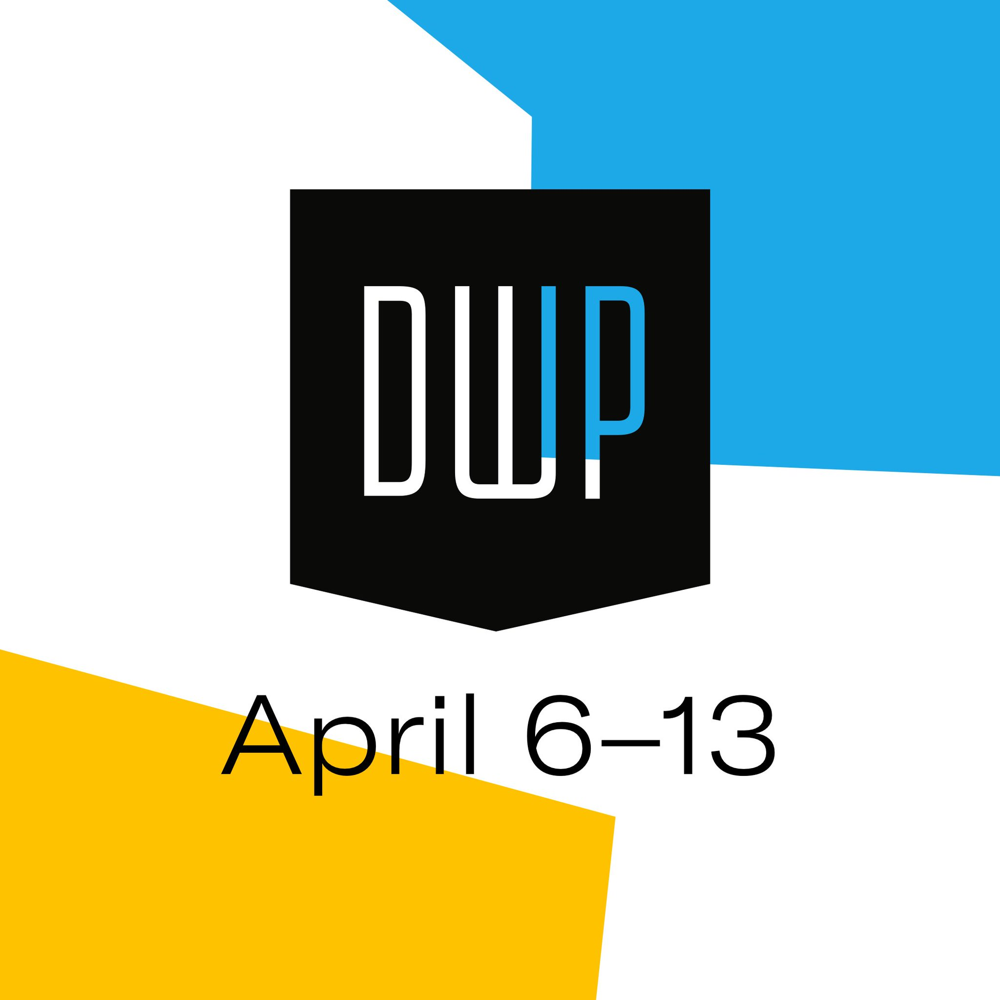

# Design Week Portland for Developers

Design Week Portland (April 6–13, 2019) is a festival offering independent events and open houses all over the city. I love using this week to meet designers and developers, learn something new, network, and find out what's going on in many disciplines of design.

This guide is a listing of events I think might be interesting for developers, but you can find out more about Design Week at [Design Portland](https://designportland.org/), or view all [events](https://designportland.org/festival/2019/schedule) and [open houses](https://designportland.org/festival/2019/open-houses) to create your own itinerary.

Hope you get out there this week and enjoy! 👋 [Tricia](http://tricialea.ch/)

---

### Monday
[Accessible Design: Empathy in a World with No Averages](https://designportland.org/festival/2019/schedule/accessible-design-empathy-in-a-world-with-no-averages) 
To learn more about accessibility through hands on experience, participate in empathy building experiences at this event.

[The Cooler: Ask A Recruiter](https://designportland.org/festival/2019/schedule/the-cooler-ask-a-recruiter) 
Ask recruiters from The Creative Party your questions.

[Better Together: Better Talk](https://designportland.org/festival/2019/schedule/better-together-better-talk) 
Learn how creatives and non-profit organizations can work together better, with panelists from both sides.

Open Houses
- [Work & Co](https://designportland.org/festival/2019/open-houses/work-co)
- [Second Story](https://designportland.org/festival/2019/open-houses/second-story)
- [Vacasa](https://designportland.org/festival/2019/open-houses/vacasa)
- [ThinkShout](https://designportland.org/festival/2019/open-houses/think-shout-happy-hour)

### Tuesday
[Democratizing VR for More Livable Cities](https://designportland.org/festival/2019/schedule/democratizing-vr-for-more-livable-cities) 
Two VR demos, and a panel discussion about the role of VR in placemaking.

[Future Frontiers: Crossing Boundaries of Innovation, Technology and Design](https://designportland.org/festival/2019/schedule/future-frontiers-crossing-boundaries-of-innovation-technology-and-design-what-does-this-mean-for-the-future-role-of-designers-makers-and-brands-an-exhibit-and-discussion-with-francis-bitonti-asher-levine-billie-whitehouse) 
An exhibition and panel discussion with designers and technologists about the future of fashion and wearable tech.

Open Houses
- [Coates Kokes](https://designportland.org/festival/2019/open-houses/coates-kokes)
- [Pollinate](https://designportland.org/festival/2019/open-houses/pollinate-inc)

### Wednesday
[Humans, AI, and The Future of Transportation](https://designportland.org/festival/2019/schedule/humans-ai-and-the-future-of-transportation) 
Consider how the passenger experience will change in the future with this talk about AI at Particle Design.

Open Houses
- [The Brigade](https://designportland.org/festival/2019/open-houses/the-brigade)
- [52 Limited](https://designportland.org/festival/2019/open-houses/52-limited)
- [Zendesk](https://designportland.org/festival/2019/open-houses/zendesk)

### Thursday
[G(AI)ME TIME](https://designportland.org/festival/2019/schedule/gaime-time) 
Find out what happens when AI invents a new sport at AKQA.

[Drink N' Draw @ DWP](https://designportland.org/festival/2019/schedule/portland-indie-game-squad-presents-drink-n-draw-dwp) 
Locally made games will be available for everyone to play at this event.

[Designing Across Senses](https://designportland.org/festival/2019/schedule/designing-across-senses) 
UX Book Club PDX hosts John Alderman, co-author of [Designing Across Senses](http://shop.oreilly.com/product/0636920049500.do), for a talk on multimodal design.

[Technology and Livability: Designing Cities for the Future](https://designportland.org/festival/2019/schedule/technology-and-livability-designing-cities-for-the-future) 
Panel that includes discussion of positive and negative implications of VR, AI, machine learning, and augmented reality on cities of the future.

[Evolving Design Landscape - Designing for Inclusivity](https://designportland.org/festival/2019/schedule/evolving-design-landscape-designing-for-inclusivity) 
Panelists from R/GA, Torch, Microsoft, and Firefox.

Open Houses
- [The Wild](https://designportland.org/festival/2019/open-houses/the-wild)
- [Daylight](https://designportland.org/festival/2019/open-houses/daylight-wine-x-design)
- [GRAYBOX](https://designportland.org/festival/2019/open-houses/graybox-your-partner-in-digital)
- [Rumors](https://designportland.org/festival/2019/open-houses/rumors)
- [Nelson Cash](https://designportland.org/festival/2019/open-houses/nelson-cash)

### Friday
[Performing Interaction Design](https://designportland.org/festival/2019/schedule/performing-interaction-design) 
Get out of your comfort zone and explore user experience through performance.

[Design with Accessibility in Mind](https://designportland.org/festival/2019/schedule/design-with-accessibility-in-mind) 
This looks to be a technology focused panel on accessibility at NWEA.

[The Pressure Is Good for You, A Talk Show](https://designportland.org/festival/2019/schedule/the-pressure-is-good-for-you-a-talk-show) 
A fun Friday night at Instrument.

---

### How to get involved
- Sign up for an account at [Design Portland](https://designportland.org/) to build an itinerary and gain access to event registration ($5)
- Register for [events](https://designportland.org/festival/2019/schedule) (events are priced individually, with some being free)
- Register to attend [open houses](https://designportland.org/festival/2019/open-houses) (all are free). Open houses are drop in Mon–Thurs from 4:00–7:00pm, with each night focusing on a quadrant of the city.
